

<h1 align='center'>
 <b> INDIVIDUAL PROjECT Nº2</b>
</h1>

# Individual Project - Data Analyts - Aircraft Crashes.
</h1>

Aircraft Crashes

I was assigned this project, desinged by my school Henry, in which I have to do the usual work of a data analyst. To develop this project I used Python, Power BI, csv files, ect. The topic is Aircraft Crashes. Below are the instructions:

# Description of the problem - context and role to be developed -

- Context:
</h1>
Air accidents are unexpected and unwanted events that involve aircraft and cause physical damage to people or the aircraft itself. An air accident can involve any type of aircraft, including commercial airplanes, private planes, helicopters, gliders, and hot air balloons.

Airline accidents can be caused by a variety of factors, such as human error, equipment failure, weather problems, maintenance problems, air traffic management failures, design problems, or manufacturing problems. And as for its consequences, they can be both in terms of human and economic losses.

That's why the aviation industry, regulatory authorities and researchers work tirelessly to improve aviation safety and prevent future accidents. On the other hand, for organizations associated with aviation, studying the causality of accidents and learning how to prevent them in the future is key to avoiding significant human losses and material damage.

- Role to develop:

The International Civil Aviation Organization (ICAO), an agency of the United Nations, wants to investigate in depth the accidents that have occurred since the beginning of the 20th century. To do this, the main objective is to be able to obtain a data analysis related to this, along with a dashboard that complements the analyzes with its visualizations.

The ICAO only has a dataset on aircraft accident data, but urges the data consultancy - of which they are a part - to try to cross-reference this information with other sources of interest. This is with the aim of obtaining greater clarity and consistency in the foundations of the study.

<h1>
<h1 align='center'>
 <b> Structure Project</b>
</h1>

 <b> 1- EDA:</b>

This project consists on three main parts. The first is the EDA (Exploratory Data Analysis) a python notebook format file, which is located in the same folder as the current file. There you will find the step by step of the EDA process, and analytical graphs with conclusions and explanation, all extracted from the data.

<b>2- Analysis:</b>

Then, almost at the end of this README you will find the analysis report of all the previously mentioned explored, analyzed and understood data. From the comprenhention of the data, I put my self into a data analyst roll and I came out with interesting facts and useful conclusion, that I used to answer the business questions I was told to respond.

One of these queries was to graph and measure the following KPI:
+ Evaluate the 10% decrease in the crew fatality rate in the last 10 years, compared to the previous decade.
+ My own KPI 

<b>3-Dashboard: </b>

The Dashboard will not be at this repository at the moment, so you can not see it right now. However, after my oral presentation, I wil dyploy the dashboard and add it to this repository. A brief definition of my Dashboard: a visual file with a specific design and layout that helps the viewer understand and interpret the analysis I did based on the instructions and KPIs.

<b>Data: </b>
The two CSV files in this repository are the data base where the information is taken of. The file 'AccidentesAviones.csv' is the file I was provided with the instructions of the project; while the file 'df_AircraftAccident.CSV' is a file created by myself, based on the previous csv file, but with some modifications that helps me to creat a optimum Dashboard 

<h1>
<h1 align='center'>
 <b> ANALYSIS REPORT</b>
</h1>

I could only define them names after examinating and analysing a couple of rows data, and the information I could get from them. My conclution was the following.

# Data Diccionary:

- aircraft_id:   specifique aircraft identification
- all_aboard:   cuantity of all the people aboard at the crash moment.
- country_state: the country or steate where the crash took place.(this information is taken from route)
- crash_time :  Time of the crash (military format)
- crew_aboard :     only members of the crew aboard
- crew_fatalities :     number of only crew fatalities
- date :    date when the crash took place
- fatalities :   number of fatalities
- flight_id :   Flight number
- ground :      Total number of people killed by the accident on the ground (people who were not on board)
- operator:     Plane's airline or simply the flight operator 
- passengers_aboard:   only pasengers abord.
- passenger_fatalities :    number of pasengers fatalities
- registration:     registration of the aircraft(alphanumeric series of characters similar to a car license plate)
- route :     The flight path taken.
- route_2 :     Additional information about the type of flight, or about the origin and/or destination of the flight.
- survived:  Number of people aboard who lived after the crash(the people aboard take into acount the passengers and the crew)
- survival rate:    The survivival percent(calculate from 'survived' and 'all_aboard)
- summary :     Brief description of the case
- type:     specific type of the aircraft (vehicule)

# The Crashes Quantity
The first variable I wanted to examinate was the Quantity of the ai crases all along the period of time taken into acount. This period covers the years from 1908 to 2021. The following graph shows how the number of accidents has evolved over the years.

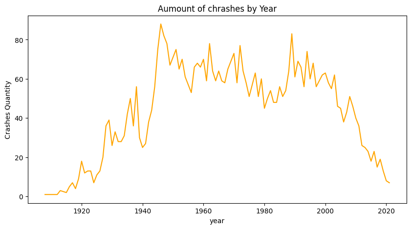

This graph shows the total crashes that ocurred per year during that period of time. From this picture we can infer the following analysis:

The first peak of the graph appears at the late 10's and the early of the 20's, this coincides with the First World War, where there was a first great technological revolution, which could have generated a series of failed experiments and consequently turn into a crashes increase. Between the 1920's and 1940's decades, the number of crashes went up and down but could not go back under the 20 chrashes per year, the reason may be because of the great advancements the in aircraft technology which maked it clear that the air would become a new means of transportation.
From the early 40's till the 50's the most remacable peak took place. This is probably directly related with the Second World War, which took place between 1939 and 1945. After it, it also took place the Cold War and with it the space race. This historical phenomenon provoked not only a aricraft technological advance, but also an increase in air accidents. Then we can see how the number of crashes do not go below 40 until the 2000, what may be due to the increase in the use of commercial flights.
Since the 2000 the aumount of air crashes decreased significaly till achieve a number below 20. The reason might be the increase of technology and aviation safety and airplanes security, that help to prevent this crashes.

To achieve a general analysis, insted of taking into acount each year I decided to see the increse and decrese of the crashes cuantity throuth the decades:

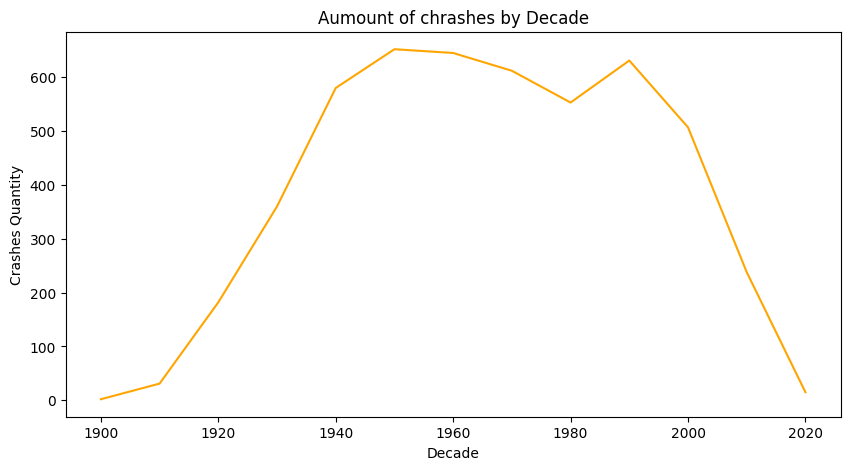

Now we can esaly see the increse of the air crashes between the 1920 and 1945. It also helps to remark the decrese of crashes during the 60's and 70's, which change during the 80's, were it is clear a increse. However, it dramaticaly change again from the 90's onwards.

<b>What year has the highest number of aircraft crashes?</b>

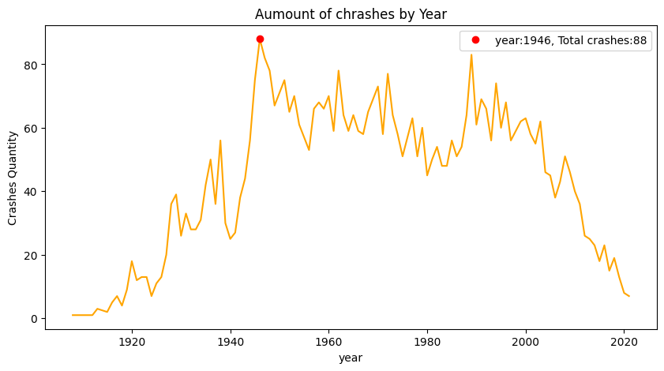

In the graph above, the red point indicates the year with the higher number of crashes. The legend on the rigth,  specify the year:1946, and the total crashes: 88, that took place in the said year.

<b>Top 5 Decades with highest amount of crashes</b>

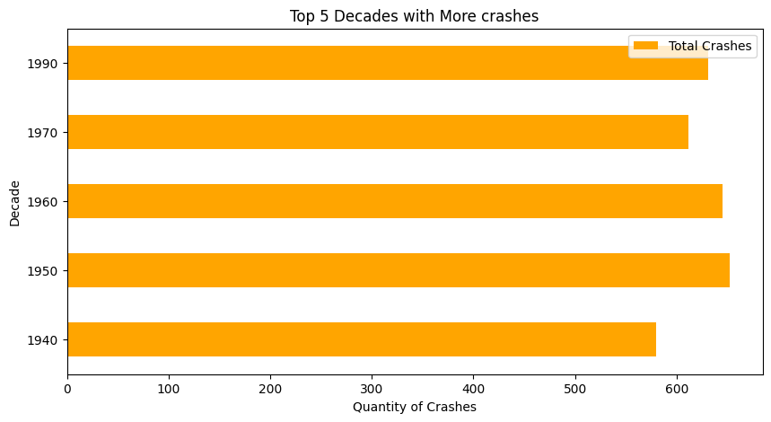

This table and bars grafic confirms what it was infered previuosly in the 'Aumount of Crashes by decade' graph, the decades between 1940 to 1990 are the top 5 decades when the majority crashes ocurred. The 1950's own the first place, followed by 1960s, only 7 crashes bellow. After the 50s the quantity of air crashes never achive a number as high as 652, it had a peak during the 1990s, with a total of 631 crashes, but since then this number only decrese. What I concluded from this analysis is that since the diferents aircrafts started to be used as a mean of transport, the amount of crashes incresed. Cleary the first and second world war afected directly in the number of air crashes making it achive the (actual) maximum peak in 1946, a yaer after the end of the Sencond World war. Tthe society migth have learned from the amount of accidents and have taken security precautions, in parallel with technological advances, all along the decades. The data shows that nowadays there are not even 20 crashes per year, this is proof that society has become aware of the seriousness of these events and has also taken measures to solve them.

<b>Top 5 Decades with less amount of crashes</b>

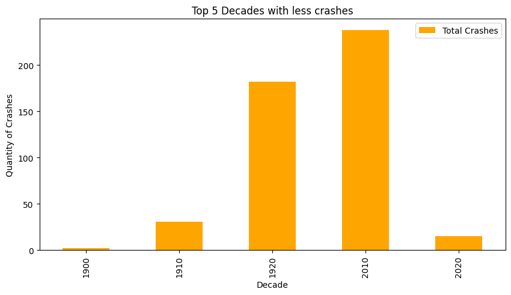

In coclusion, from these last figures, the period of time between 1940 to 1990 suffered the majority of the aircraft crashes all along the 20th and early 21st centuries. This could means that thanks to technological advances the diferents aircrafts security improved over the years. I come out with conclution because the years with less crashes are at the begginig and the end of the period of time taked into acount.

# Crashes Location

Considering there are only 5 rows with unkown route, procid to analys the diferent places where the crashes took place.

<b>Where did the aircfats crashes happened the most?</b>

<b>Ranking of the Top 10 Cities where more air crashes took place.</b>

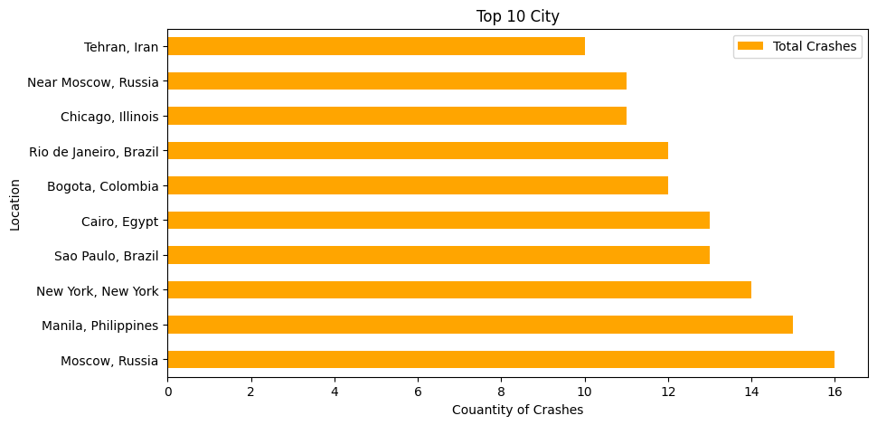

The previous graph is print to show in a more visual way the small diferent between the cuantity of the crashes in the Top 10 Locations with more air crashes in the world, during the period of time between 1908 to 2021. The diferent between Moscow, Russia and Manila, Philippines seems to be just a single crash, however, that would change if the second Location in the graph (Near Moscow Russia) was consider as Moscow as well. Since the word "Near" is not quite specific, and I can not tell how much "near" means, I decided to keep it as a diferent category.
Although, if the viewer prefer to join both Locations as one: Moscow,Russia will be the undeniable first place of this ranking, with a total of 27 air crashes, between 1908 and 2021. The caouse of this could be the relevant participation Russia had during the first and second War, and the spacial Race during the cold war.

<b> Analysing  'Moscow, Russia' crashes:</b>

Since this Location is the one with the bigest number of crash event, lets do a World Cloud of them summaries

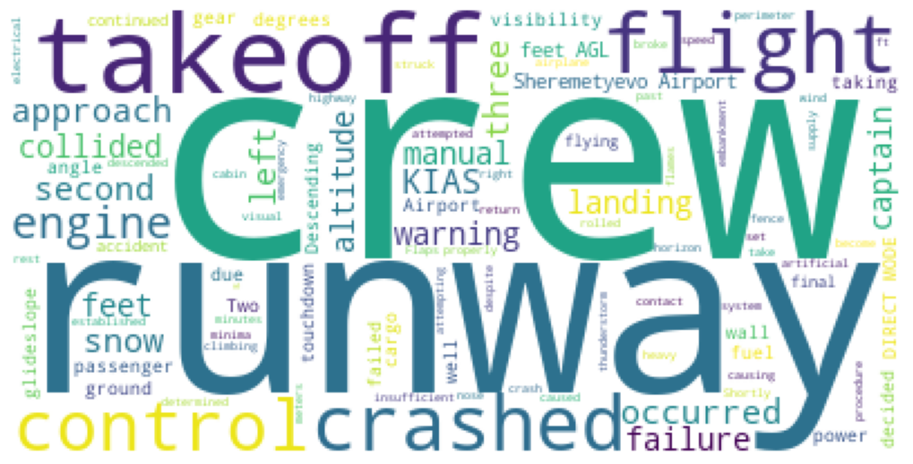

<b>Ranking of the Top 10 Countries where more air crashes took place.</b>
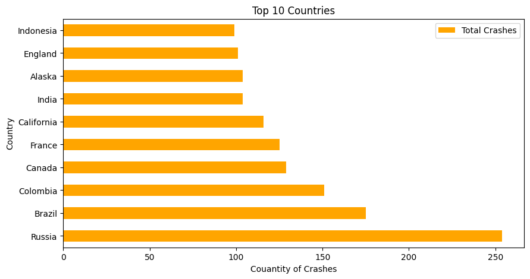

In this graphic is not taking into acount the city of the crash, but the country. The orange bars show the number of crashes that happend in each country, thanks to the graph, it is clear at first sight that Russia wins the first place at the Top 10 Countries with more crashes Ranking, with a total crashes higher than 250, all along the 20th and 21st century. It is not surprising that this powerful and enormous country is the head in this ranking, because of their important and notable intervention in this wordl hystory.  

# Aircraft Type

<b> What type of aircraft crashes the most alogn the 20th and 21st century?</b>

This graphic shows the 10 aircraft types which accumulated more air crashes in the 20th and 21st century. The Douglas DC-3 plane is the undeniable first place, with more than a 200 crashes over the second place: 'de Havilland Canada DH-6 Twin Otter 300'.

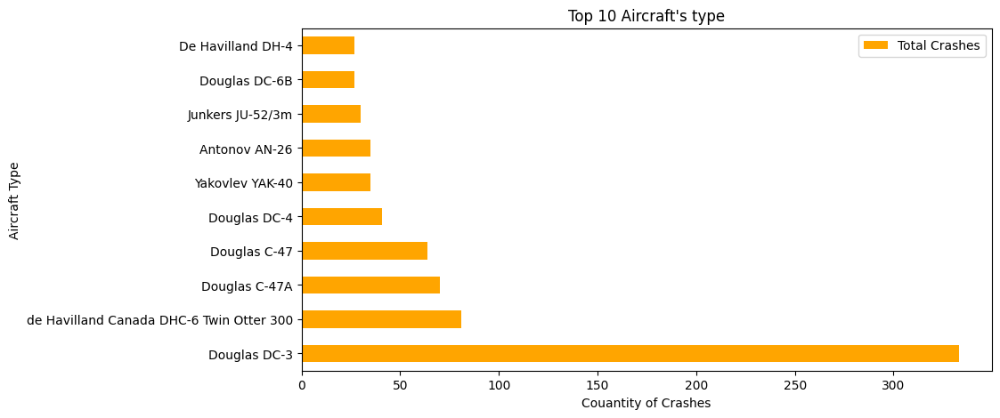

Knowing wich is the Aircraft type that has crashed the most let see:

<b> How many crashes did this aircraft has along the 20th and 21st century?</b>

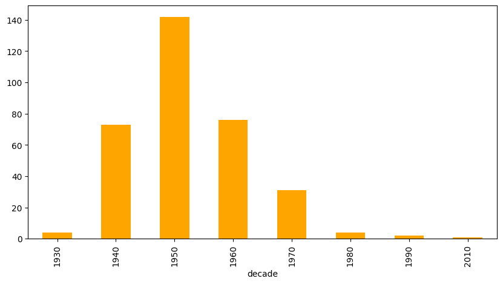

This amount of crashes proof how insecure was the  'Douglas DC-3' between the 1940s ans 1960s. Seing this, I decided to creat a cloud word of the summaris of only the 'Douglas DC-3' crashes:

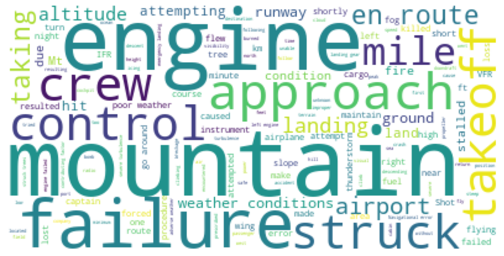

From this word cloud (that ignores the following words: 'aircraft','plane','Crashed','pilot','flight'), that remark the words 'failure', 'engine', and 'mountain', I infer that the different Douglas DC-3's accidents and crashes were related to the engineering of the vehicle and the environment it faced. This one may not have been prepared for it.

# The Crashes Fatality

<b>Which gruop of people was the most subject to die along the centuries?</b>

Crew vs Passengers

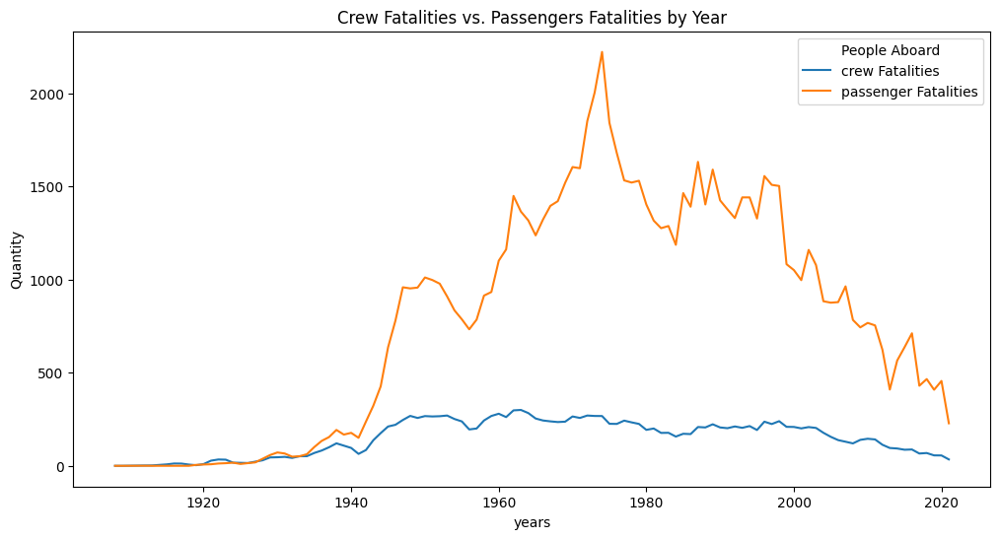

This time line graph shows the number of passenger's fatalities comparing to the number of crew's fatalities, alogn the years. Since 1940 to 2010 the passengers fatalities is way higer than the crew fatalities, which was expected up to a point, because the number of passenger is generaly way higer than the number of the crew members on a flight. However, this can also be caused thanks to the preparation, experience and profesional studies that the crew members acquire over the years. Besides the fact that at first sight the number of the crew fatalities looks very stable over the years, I consider significant the slight decrease of this number between the 2000s and 2020s, which coincides with the conclusion of the previous analysis, about the improvement in the aircraft tecnology and security.

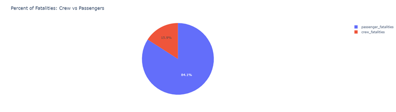

Thanks to this pie graphic we can cleary see that the crew fatalities is only the 15.9% of the total amount of fatalities of the people aboard, while the passengers ends are the rest 81.1%. Just to remind the viewer, this graph is only taking into acount the number of fatalities of the peopleo that were aboard of the aircraft at the moment of the crash, here is not reflected the number of fatalities written on the column 'ground'. The objective of this graphic is to see in a more visual and effective way the proportion of fatalities between the too gruop of peopleo aboard the aircraft.

<b> Added 2 columns to make a deeper analysis of the Fatality</b>

The following analysis takes into account the fatality of the events. For this part of the analysis, I decided to create two new columns 'survived' and 'survival rate' so it is clear not only the fatalities but also the survival of the diferent crashes.

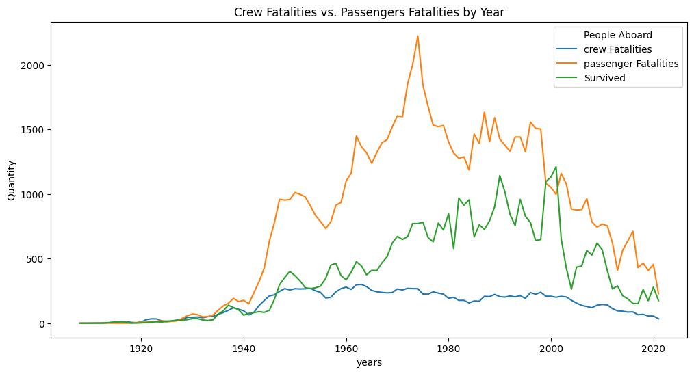

The new line in this graph shows the number of the people who were aboard and survived the crash. I decided to included this values as well, to see if over the years there were as much survived as fatalities. To my surprise and joy, between 1940 and 2000 the number od survivors tend to increase(with some ups and downs, of course), up to the point that during the 2000s the number of survivors were even higher than the fatalities. This is not only optimistic, but also a proof of the improvement in the security and safety of the diferents airlines or operators. However, after the 2000s their is a dramatic decrease, and after that, the number of suvivors tend to go down, as well as the fatalities, the cause of this may be the drecrease in the number of creshes.

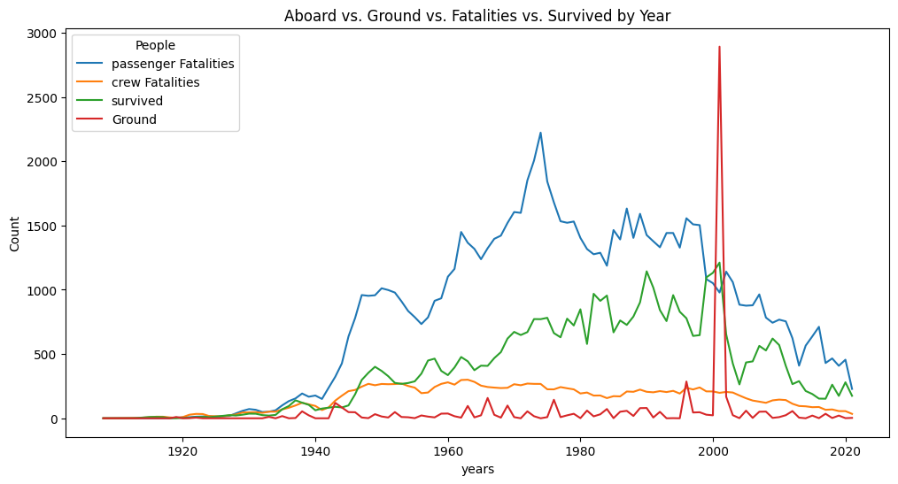

The last but not least gruop of values I wanted to include in this time line graph was the column ground. This line seems to be quite stable along the 20th century, with small peaks, specially during the last 40th years of this century. This shows that before the 2000s, normaly, no matter how much the number of crashes increse, those did not have a big impact in the people on the ground (at least no big enough to increase a lot the number of fatalities). Nevertheless, this evidentialy changed right after the 2000, the number of ground fatalities increses a 5000% in less than a year. The reason of this enormous change it is probably the Terrorist Attack on the twin towers in 2001-09-11, in New York, USA.

<b> Outlier: during the  2001</b>

- What happend?

The number of people killed by the event on the ground : <b>  2750 </b> 

<b> Summary:</b> 'The aircraft was hijacked shortly after it left Logan International Airport in Boston. The hijackers took control of the aircraft and deliberately crashed it into the north tower of the World Trade Center between the 94th and 99th floors at approximately 450 mph.  After 102 minutes, the building collapsed. It was one of four planes that were hijacked the same day.'

# Operator examination
<b> Which are the Operators wirh the higher number of accumulated crashes?</b>

Top 5 Operators with more accumlated crashes:

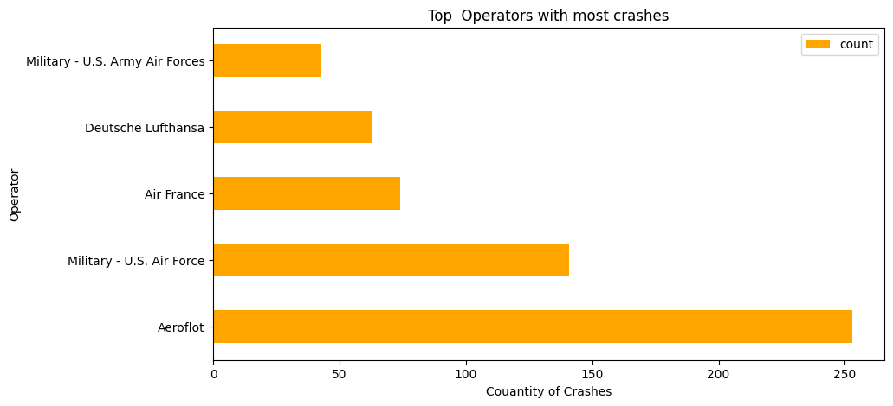

<b> Which are the Operators wirh the higher number of Fatalities?</b>

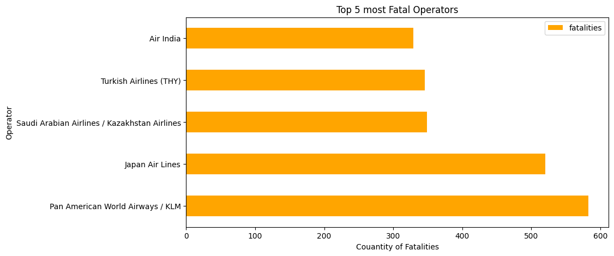

- Conclution: 

It is important to diference the Operator with most crashes to the most fatal Operator. The first one is the one that have been involved in most air crashed, while the second one is the one that have been in one or more catastrophic crashes that provoked a very high number of fatalities.

Here we can see how dispite the fact that the operator: Aerofolt had more than 250 crashes alogn the 20th and 21st centuries, this one is not the most fatal operator of all, actually is not even in the Top 5 most Fatal operators . Pan American World Airways / KLM is the most fatal operator, with a total of 583 fatalities acumulated alogn the las two centuries. 

In the row number 2902 of the DataFrame that i being analys, can read the information about the only 'Pan American World Airways / KLM' crash, wich took place in 1977 in Tenerife, Canary Islands. The data only registred one crash by this operator, but it was more than enought to posisionate the operator at the top of the most Fatal Operator. With a total of 644 people aboard the aircraft (614 passengers and 30 crew members),this flight end up with 583 fatalities(23 members of the crew and 560 passengers) and only 61 survivors, this means that the survival rate of this fligth was under the 10% (9.47%). 

Lets analys the cause of this crash:

<b> Why so many Fatalities? What happend?</b>

After examinating the summary crash I concluded That:

This enourmous number of fatalities, definitly and outlier in the analysis, was caused of a lack of organization and proper administration  from the  NTSB and the, and also afected by a heavy fog that was on the runway that day. The two aircrafts, KLM and Pan Am, were diverted to Tenerife because of a bombing at Las Palmas Airport, and both planes were instructed to back track up the runway, the KLM could not see the other plane because of the fog and the and could not hear the warnings because of the transmissions were simultaneous interfered with each other plane. At the end KLM plane hit the Pan Am plane just as it was taking off and  both planes burst into flames. None suvived from the KLM, which may have done that despite the circumstances the KLM plane was blamed for taking off without permission by the NTSB.

<h1>
<h1 align='center'>
 <b> Report CONCLUTION</b>
 </h1>

Thanks to all the information previously collected, I would like to conclude with a general analysis of the data.

Seeing and considering how both the Fatality and the Number of Air Crashes throughout the 20th and early 21st centuries had its maximum peak in 1946 and since 1990 (in general terms) it has only decreased, I interpret that thanks to the new technologies, to the mistakes made that led to catastrophes (such as the one in 1977 in Tenerife, Canary Islands), humanity has learned and improved the use of air transport. Generating in this way that today it is very safe to fly.

<h1> </h1>
<b>Technology Stack:</b>

+ Python:
    - numpy
    - pandas
    - datetime
    - matplotlib
    - wordcloud
    - seaborn
    - plotly
    - warnings

+ PowerBI :
    - dashboard

<b>Contact methods: </b>

+ Email: trini.pliauzer@gmail.com
- LinkedIn: Maria Trinidad Pliauzer